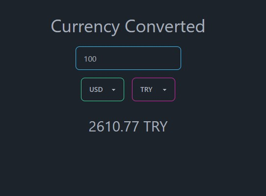

# Currency Converter App Challenge 💰

## Features

- useState and state management
- useEffect
- Tailwind css
- prop types

## Screenshots



## Run Locally

Clone the project

```bash
  git clone https://link-to-project
```

Go to the project directory

```bash
  cd my-project
```

Install dependencies

```bash
  npm install
```

Start the server

```bash
  npm start
```

## API Usage

#### This app utilizes the Frankfurter API to fetch the latest exchange rates. The API is accessed using the fetch function provided by the browser.

### The API endpoint used for currency conversion is:

```
https://api.frankfurter.app/latest?amount={amount}&from={fromCurr}&to={toCurr}
```

```
#### {amount}: The amount to be converted (default: 1)

```

```
{fromCurr}: The currency to convert from (default: USD)

```

```
{toCurr}: The currency to convert to (default: TRY)

```

## Acknowledgements

This my finished React Currency Converter App PART- 2 Challenge - 2 based on A Ultimate React Course by Jonas Schmedtmann

As the description suggests, the original design was done by Jonas Schmedtmann and was part of a Ultimate React Course which I highly recommend. https://www.udemy.com/course/the-ultimate-react-course/

## License

[MIT](https://choosealicense.com/licenses/mit/)
